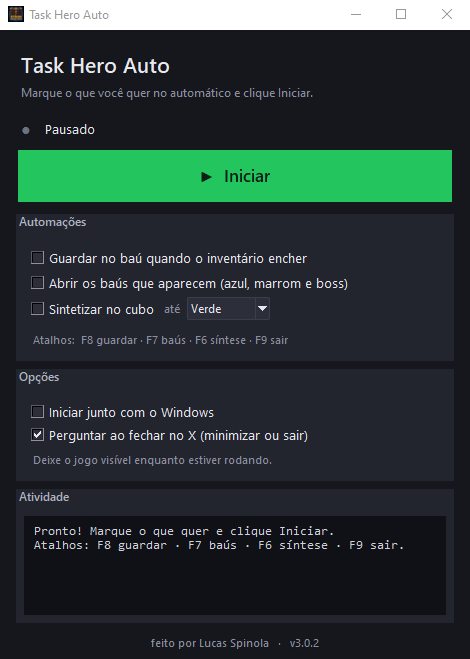

# task-hero-auto

**Deixa as tarefas repetitivas do _Task Hero_ no automático, guardar no baú, abrir os baús e sintetizar no cubo, sem você ficar clicando.**

É um programa de Windows onde você marca o que quer que ele faça e ele cuida do resto. Não precisa
instalar nada, não precisa configurar nada, é só abrir o jogo, abrir o programa e marcar as caixinhas.

[O que faz](#o-que-faz) · [O que você precisa](#o-que-você-precisa) · [Como usar](#como-usar) · [Se não funcionar](#se-não-funcionar)

---

No _Task Hero_ o inventário enche o tempo todo, os baús ficam dropando e ainda dá pra ir sintetizando
item no cubo, e isso vira aquela repetição chata de abrir o baú, guardar tudo, clicar nas caixinhas e
voltar pro cubo, esse programa faz tudo isso por você, é só ligar o que quiser e deixar rodando enquanto
você faz outra coisa.

## O que faz

- **Guardar no baú,** quando aparece o aviso de inventário cheio, ele abre o baú e guarda tudo, em todas
  as abas que você tiver como 1, 2 e também a 3, que ele percebe sozinho se já possui.
- **Abrir os baús,** aquelas caixinhas azul e marrom que aparecem no combate ele clica assim que surgem.
- **Sintetizar no cubo,** de tempos em tempos ele abre o cubo, usa o preenchimento automático e cria,
  repetindo até acabar os itens, o intervalo vem em 10 minutos e dá pra mudar.
- **Funciona sem ajuste,** ele se vira com a janela do jogo em qualquer lugar e tamanho, e em qualquer
  monitor.
- **Fácil de controlar,** uma janelinha com caixinhas pra ligar e desligar, com o status e um histórico
  do que ele fez.
- **Fica no seu canto,** quando você fecha no X ele vai pra bandeja do Windows e continua rodando, e dá
  pra marcar pra abrir junto com o computador.
- **Seguro,** começa tudo desligado, e se você jogar o mouse no canto superior esquerdo da tela ele para
  qualquer clique na hora.

## O que você precisa

Bem pouca coisa, só isto:

- Um computador com **Windows 10 ou 11**.
- O jogo **Task Hero** aberto e **à mostra** na tela, sem minimizar e sem cobrir com outra janela.
- O arquivo **`TaskHeroAutoStash.exe`**, que você baixa pronto, sem instalar nada e sem precisar de
  Python.

## Como usar

1. Baixe o programa no botão **Baixar o programa** lá no topo desta página, ou pela seção **Releases**
   do repositório, e salve onde quiser.
2. Abra o **Task Hero** e deixe a tela do jogo visível.
3. Dê **dois cliques** no `TaskHeroAutoStash.exe`, vai abrir a janelinha do programa.
4. Marque o que você quer no automático:
   - **Guardar no baú quando o inventário encher**
   - **Abrir os baús que aparecem**
   - **Sintetizar no cubo de tempos em tempos**
   - **Iniciar junto com o Windows**, se quiser que ele abra sozinho ao ligar o PC
5. Pronto, pode deixar rolando, e se quiser tirar da frente é só fechar no **X**, que ele continua
   trabalhando na bandeja. Pra encerrar de vez, clique no ícone da bandeja e escolha **Sair**, ou aperte
   **F9**.

Se preferir o teclado, dá pra ligar e desligar por atalho a qualquer momento, **F8** guarda, **F7**
abre os baús, **F6** sintetiza e **F9** sai.

> **Importante,** enquanto alguma coisa estiver ligada o programa mexe no mouse, então é melhor não usar
> o computador ao mesmo tempo, e se precisar parar na hora, jogue o mouse no canto superior esquerdo da
> tela, que ele aborta o clique.

### O Windows mostrou um aviso azul?

Como o programa não é assinado digitalmente, na primeira vez o Windows pode mostrar uma tela azul de
proteção chamada SmartScreen, isso é normal com programas pequenos, é só clicar em **Mais informações**
e depois em **Executar assim mesmo**.

## Se não funcionar

- **Diz que está procurando o jogo,** deixe a tela de combate visível e não coberta por outra janela.
- **Não guarda quando enche,** abra com `TaskHeroAutoStash.exe --debug`, que ele mostra um número de
  confiança, e ajuste o `trigger_threshold` no arquivo `config.json` que fica ao lado do programa.
- **Clicou no lugar errado,** rode `TaskHeroAutoStash.exe --once`, que ele faz um ciclo só e salva
  imagens de cada passo na pasta `%TEMP%\th_shots`, daí dá pra ver onde ele clicou.
- **As teclas não respondem,** abra o programa como administrador.

O arquivo `config.json` é criado sozinho na primeira vez, e nele dá pra mudar coisas como em quais abas
guardar, o intervalo da síntese e os atalhos, mas no uso normal você não precisa mexer em nada.

## Aviso

Ferramenta de uso pessoal pra automatizar uma tarefa repetitiva, use por sua conta, lembrando que
automação pode ir contra as regras de algum serviço.

## Licença

O código está sob a licença MIT, descrita em [LICENSE](LICENSE).
